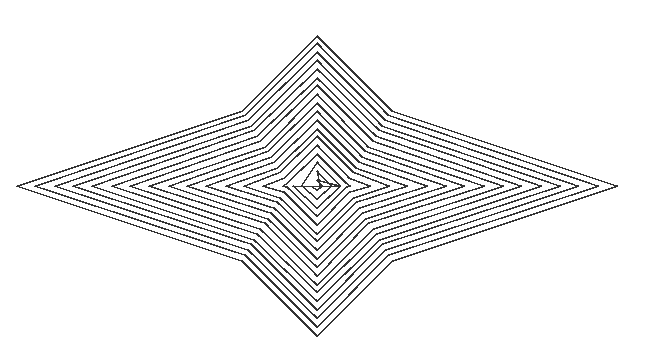

[toc]
# 非自交内缩包围线生成函数

##### 注意：本函数是基于Matlab 2022b进行编写的，如遇到报错很有可能是版本问题对不上，可以查看Matlab的官方文档来进行调整

**感谢这位大佬的算法支持，本函数仅仅是在它的基础上对实际生产进行应用**

**下面是相应链接，欢迎大家去star：**
https://github.com/Lee-0o0/polygon-offset-algorithm

## 1. 环境配置

### 1.1 Jar包的导入和函数的导入
首先要将polygon-offset-algorithm.jar和对应的函数(.m)放置到和工程文件同一目录下


### 1.2 Java环境配置
其次，要保证当前的环境是处于Java8的，不然系统会报错。[^3]

根据Matlab官方文档[^1]显示
2022b对应适配的JDK为1.8即Java8


Matlab推荐的官方JDK1.8下载地址：
https://adoptium.net/zh-CN/

下载的选项应当为：Windows x64 JDK 8

如下图所示，配置好环境


也可以新建一个MATLAB_JAVA的环境变量，单独配置JDK1.8，这样不会干扰到其他文件运行

## 2. 使用方法
### 2.1 Java类文件路径的加入 [^2]
**动态路径的加入**
首先要将jar包加入到动态类文件路径当中，可以放在调用前，以防每次重新打开造成的路径丢失的问题
```Matlab
javaaddpath("polygon-offset-algorithm.jar");
```
**静态路径的加入**
或者是添加到静态路径当中，就不需要每次重新启动都要添加路径了。
如下：在命令行输入下列代码，如果显示没找到，是否创建？直接创建即可，然后把jar包的绝对路径加入到行末即可，如 C:\Documents\MATLAB\polygon-offset-algorithm.jar

**注意：是绝对路径！**
```matlab
cd(prefdir)
edit javaclasspath.txt
```

可以参考对应官方文档

**查看是否加入成功**

下面这行代码输入到命令行可以用于检查是否加入成功，如果加入成功了可以在末尾看到对应的jar包的绝对路径
```matlab
javaclasspath;
```

### 2.2 shrinkHull_Interface
直接调用result=shrinkHull_Interface(vertices,distance)，vertices为点矩阵，distance为内缩或者外扩的距离，正则内缩，负则外扩（未实现，若想进一步实现可以直接调用jar包对应函数来更迭）

这个函数会将输入的vertices矩阵转换为Java的ArrayList类型，并进一步调用shrinkHull函数进行生成轮廓线
返回的result是含有所有内缩轮廓线的cell数组，每个cell元素是一条轮廓线
对于分块的情况则是会用一个只有[0,0]的cell元素来分隔，可以根据实际情况进行使用

### 2.3 shrinkHull
下面是主要的函数shrinkHull，shrinkHull_Interface会对传进来的矩阵进行预处理，然后把处理后的结果交给shrinkHull。

shrinkHull的逻辑主要是递归，遇到分块就按块递归，没有分块就直接递归，若调用jar包的函数的返回值是空，也即代表缩进无效，直接返回。

```matlab
function result=shrinkHull(inputPoints,distance)
    import com.lee.algorithm.OffsetAlgorithm;
    import com.lee.entity.Point;
    result = {};

    % 进行内缩处理，获得新的点集
    newPointsCell = OffsetAlgorithm.offsetAlgorithm(inputPoints, distance);
    disp(newPointsCell);
    % 检查是否有多个分块
    if isempty(newPointsCell)
        % 如果没有产生新的轮廓，返回空
        return
    elseif newPointsCell.size()>1
        temp={};
        for w=0:newPointsCell.size()-1
            newPoints = newPointsCell.get(w);
            offset = [];
            for k = 0:newPoints.size()-1
                point = newPoints.get(k);
                x=double(point.getX());
                y=double(point.getY());
                % 存储新的轮廓
                offset = [offset; x,y];
            end
            if ~isempty(offset)
                temp{end+1,1}=offset;
            end
        end
        % 处理每个分块
        for w=0:newPointsCell.size()-1
           block_result=shrinkHull(newPointsCell.get(w),distance);
           result{end+1,1}=[0,0];
           result{end+1,1}=temp{w+1};
           for m=1:size(block_result,1)
               disp(block_result{m});
           end
           % 将每个分块加入到结果中
           for k=1:size(block_result,1)
               result{end+1,1}=block_result{k};
           end
           for m=1:size(result,1)
               disp(result{m});
           end
        end      
    else
        % 处理单一轮廓的情况
        newPoints = newPointsCell.get(0);
        if isempty(newPoints)
            disp('No valid contour generated.');
        else
            offset = [];
            for k = 0:newPoints.size()-1
                point = newPoints.get(k);
                x=double(point.getX());
                y=double(point.getY());
                % 存储新的轮廓
                offset = [offset; x,y];
            end
            if ~isempty(offset)
                result{end+1,1}=offset;
                disp(offset);
            end

            % 递归调用继续内缩当前新轮廓
            block_result = shrinkHull(newPoints, distance);  
            for k = 1:size(block_result, 1)
                result{end+1, 1} = block_result{k};
            end
        end
    end
end
```
### 2.3 测试&输出
下面是与shrinkHull_Interface效果类似的测试函数，会在画板上画出内缩线，上一层的内缩线的尾部会和当前层的内缩线的头部进行相连，分块的时候则不会和上一层相连
```matlab
function shrinkHull_test(testpoints,distance)
    % 导入Java类
    import com.lee.algorithm.OffsetAlgorithm;
    import com.lee.entity.Point;
    
    % 创建点对象
    points = java.util.ArrayList();
    for i = 1:size(testpoints,1)
        points.add(Point(testpoints(i,1), testpoints(i,2)));
    end
    
    %调用子函数，输出结果
    %输出结果类型为cell
    %对于分块间有一个单独的cell元素[0,0]用于分隔
    result = shrinkHull(points,distance);
    
    %处理并绘制
    for i = 1:size(result,1)
        flag=true;
        if result{i}(1,1)==0&&result{i}(1,2)==0
            flag = false;
            continue
        elseif flag && i>2 && result{i-1}(1,1)==0
            plot([result{i-2}(end,1),result{i}(1,1)],[result{i-2}(end,2),result{i}(1,2)],'k');
        elseif flag && i>1
            plot([result{i-1}(end,1),result{i}(1,1)],[result{i-1}(end,2),result{i}(1,2)],'k');
        end
        plot(result{i}(:,1),result{i}(:,2),'k');
        hold on;
    end
end
```
在将shrinkHull_Interface标注掉，前面加上
```Matlab
shrinkHull_test(testPoint,3)
```

将前面提供的测试用例取消注释


函数输出

## 3. 不足之处
### 3.1 外扩未解决
由于本算法的递归特性，无法保证同时外扩和内缩的终止条件，可以继续完善。
### 3.2 距离过大或者多边形过小容易漂移
当设定的内缩距离distance过大或者多边形相邻点过于接近的时候容易漂移。

### 3.3 内部轮廓相交缠

## 4. jar包的生成
### 4.1 原因
源库所提供的jar包在版本上出现了问题，在使用jar包来完成一系列的任务的时候，应当保证Matlab 所支持的JDK版本和jar包的MCR的版本对应，否则在导入类文件的时候往往会报错。

### 4.2 操作步骤[^4]
为防止jar包丢失或者使用了其他版本的Matlab，这里展示如何生成一个可以使用的jar包

在成功配置好Matlab的Java环境后，可以在Matlab命令行输入下面这行代码来验证当前的JRE
```Matlab
version -java
```
随后将参考代码库的源代码文件解压后在终端进入到文件路径
```bash
cd polygon-offset-algorithm-master
```
将所有的函数文件进行编译  注意：此时的java环境应当为Java8，可以通过下面这行来查看当前的Java版本
```bash
java -version
```

编译，--release 后面跟着的数字代表着想要编译的MCR版本
```bash
javac --release 8 -d out src/com/lee/algorithm/*.java src/com/lee/display/*.java src/com/lee/entity/*.java src/com/lee/test/*.java src/com/lee/util/*.java
```

生成jar包
```bash
 jar cvf polygon-offset-algorithm.jar -C out .
```
生成完之后会在当前文件目录下看到对应jar包

## 参考列表
[官方文档如何在Matlab当中使用Java](https://ww2.mathworks.cn/help/matlab/using-java-libraries-in-matlab.html?s_tid=CRUX_lftnav)

[如何配置Java类文件路径](https://ww2.mathworks.cn/help/matlab/matlab_external/static-path-of-java-class-path.html )

[环境配置参考的文章](https://blog.51cto.com/u_16213675/9399685)

[内缩外扩函数参考的文章以及代码库](https://github.com/Lee-0o0/polygon-offset-algorithm)
[^1]:[官方文档如何在Matlab当中使用Java](https://ww2.mathworks.cn/help/matlab/using-java-libraries-in-matlab.html?s_tid=CRUX_lftnav)

[^2]:[如何配置Java类文件路径](https://ww2.mathworks.cn/help/matlab/matlab_external/static-path-of-java-class-path.html )

[^3]:[环境配置参考的文章](https://blog.51cto.com/u_16213675/9399685)

[^4]:[内缩外扩函数参考的文章以及代码库](https://github.com/Lee-0o0/polygon-offset-algorithm)


